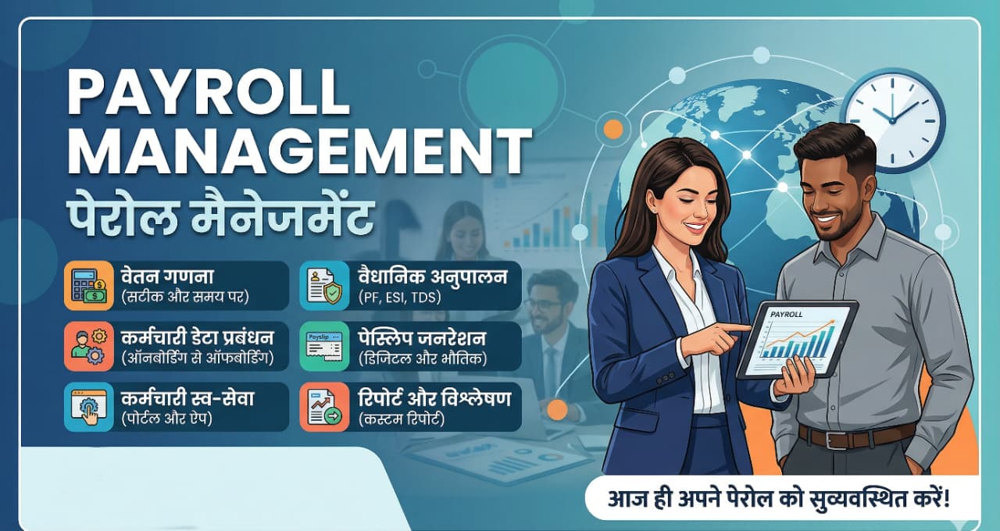
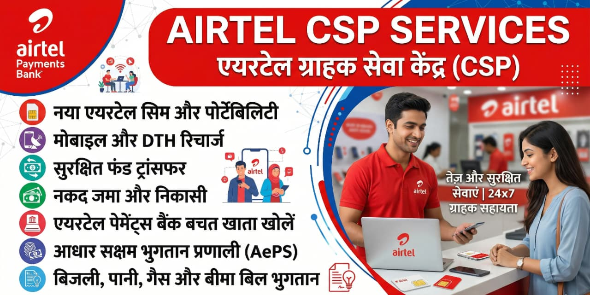

<!DOCTYPE html>
<html lang="en">
<head>
    <meta charset="UTF-8">
    <meta name="viewport" content="width=device-width, initial-scale=1.0">
    <title>ZABKA MB SOLUTIONS PVT LTD</title>
    
    <link rel="stylesheet" href="https://cdnjs.cloudflare.com/ajax/libs/font-awesome/6.4.0/css/all.min.css">
    
    <link rel="preconnect" href="https://fonts.googleapis.com">
    <link rel="preconnect" href="https://fonts.gstatic.com" crossorigin>
    <link href="https://fonts.googleapis.com/css2?family=Inter:wght@300;400;500;600;700;800;900&display=swap" rel="stylesheet">
    
    
</head>
<body>

    <header id="main-header">
        <nav>
            
ZABKA MB SOLUTIONS

            
            

                <i class="fa-solid fa-bars"></i>
            

            <ul id="nav-list">
                <li><a href="#home">Home</a></li>
                <li><a href="#about">About Us</a></li>
                <li><a href="#services">Services</a></li>
                <li><a href="#why-choose">Why Choose Us</a></li>
                <li><a href="#contact">Contact Us</a></li>
            </ul>
        </nav>
    </header>

    <section id="home">
        

            
        

        

            
        

        

            
        

        

            
        

        

            
            
            
            
        

    </section>

    <section id="about" style="background-color: var(--bg-white);">
        

            <h2>About Us</h2>
            
Leading Provider of Telecom & Manpower Solutions

            
            

                

                    <strong>ZABKA MB SOLUTIONS PRIVATE LIMITED</strong> is your trusted partner for comprehensive Airtel CSP services and professional manpower solutions. As an authorized Airtel Customer Service Point, we provide complete telecom services including new connections, recharges, and billing solutions.
                

                

                    Our manpower division specializes in recruitment, contract staffing, and workforce management across various industries. With a commitment to excellence and customer satisfaction, we deliver reliable, efficient, and cost-effective solutions tailored to your business needs.
                

            

            

                

                    <i class="fa-solid fa-certificate"></i>
                    
<strong>Authorized Partner</strong> Official Airtel CSP

                

                

                    <i class="fa-solid fa-user-tie"></i>
                    
<strong>Expert Team</strong> Trained Professionals

                

                

                    <i class="fa-solid fa-bolt"></i>
                    
<strong>Quick Service</strong> Fast Processing

                

                

                    <i class="fa-solid fa-headset"></i>
                    
<strong>24/7 Support</strong> Always Available

                

            

        

    </section>

    <section id="services" style="background-color: var(--bg-body);">
        

            <h2>Our Services</h2>
            
Comprehensive Solutions for Your Business From telecom services to manpower management, we have you covered.

            <h3 class="service-category-title">Airtel CSP Services</h3>
            

                

                    <i class="fa-solid fa-user-plus"></i>
                    <h3>New Connections</h3>
                    
Get new Airtel prepaid and postpaid connections with instant verification and quick activation.

                

                

                    <i class="fa-solid fa-indian-rupee-sign"></i>
                    <h3>Recharge & Bill Payment</h3>
                    
Secure, quick, and easy mobile recharge and bill payment services for all Airtel customers.

                

                

                    <i class="fa-solid fa-sim-card"></i>
                    <h3>SIM Services</h3>
                    
SIM activation, secure upgrades, replacements, and hassle-free MNP (Porting) services.

                

            

            <h3 class="service-category-title">Manpower Solutions</h3>
            

                

                    <i class="fa-solid fa-users-viewfinder"></i>
                    <h3>Recruitment Services</h3>
                    
End-to-end recruitment solutions designed to source both skilled and unskilled workforce needs.

                

                

                    <i class="fa-solid fa-file-contract"></i>
                    <h3>Contract Staffing</h3>
                    
Flexible, compliant contract-based workforce solutions tailored for short and long-term projects.

                

                

                    <i class="fa-solid fa-handshake"></i>
                    <h3>Permanent Placement</h3>
                    
Strategic recruitment helping you find and hire the right long-term talent for your organization.

                

                

                    <i class="fa-solid fa-industry"></i>
                    <h3>Industry Solutions</h3>
                    
Specialized manpower provisioning for IT, manufacturing, retail, and hospitality sectors.

                

                

                    <i class="fa-solid fa-file-invoice-dollar"></i>
                    <h3>Payroll Management</h3>
                    
Complete payroll processing, administrative management, and strict regulatory compliance services.

                

                

                    <i class="fa-solid fa-chalkboard-user"></i>
                    <h3>Training & Development</h3>
                    
Professional skill enhancement and corporate training programs to boost workforce productivity.

                

            

        

    </section>

    <section id="why-choose" style="background-color: var(--bg-white);">
        

            <h2>Why Choose Us</h2>
            
Your Success is Our Priority Experience the difference with our professional services and dedicated support.

            
            

                

                    <i class="fa-solid fa-shield-halved"></i>
                    <h3>Authorized Partner</h3>
                    
Official Airtel CSP delivering certified services and 100% genuine products.

                

                

                    <i class="fa-solid fa-users-gear"></i>
                    <h3>Expert Team</h3>
                    
Experienced industry professionals completely dedicated to customer satisfaction.

                

                

                    <i class="fa-solid fa-stopwatch"></i>
                    <h3>Quick Service</h3>
                    
Optimized workflows ensuring fast processing and instant activation for all services.

                

                

                    <i class="fa-solid fa-headset"></i>
                    <h3>Reliable Support</h3>
                    
Round-the-clock dedicated customer support for all your operational queries.

                

                

                    <i class="fa-solid fa-chart-line"></i>
                    <h3>Competitive Pricing</h3>
                    
Best market rates and transparent pricing models with absolutely no hidden charges.

                

                

                    <i class="fa-solid fa-network-wired"></i>
                    <h3>Wide Network</h3>
                    
Extensive operational reach across multiple locations for seamless service delivery.

                

            

        

    </section>

    <section id="contact" style="background-color: var(--bg-body);">
        

            <h2>Contact Us</h2>
            
Have questions? We're here to help. Reach out to our team today.

            
            

                

                    <h3>Send us a Message</h3>
                    
Fill out the form below and our executive will get back to you shortly.

                    
                    <form action="#" method="POST">
                        

                            <input type="text" class="form-control" placeholder="Full Name *" required>
                        

                        

                            <input type="email" class="form-control" placeholder="Corporate Email *" required>
                        

                        

                            <input type="tel" class="form-control" placeholder="Phone Number *" required>
                        

                        

                            <select class="form-control">
                                <option value="" disabled selected>Select Service of Interest</option>
                                <option value="Airtel CSP">Airtel CSP Services</option>
                                <option value="Manpower">Manpower Solutions</option>
                                <option value="Both">Both Services</option>
                                <option value="Other">Other Corporate Inquiry</option>
                            </select>
                        

                        

                            <textarea class="form-control" rows="5" placeholder="Your Message / Requirements *" required></textarea>
                        

                        <button type="submit" class="btn btn-primary" style="width: 100%;">Submit Message</button>
                    </form>
                

                

                    

                        <i class="fa-solid fa-phone"></i>
                        

                            <h4>Phone</h4>
                            
<strong>Main Contact:</strong> +91 8587017507

                            
<strong>Alternate:</strong> +91 9667270256

                        

                    

                    
                    

                        <i class="fa-solid fa-envelope"></i>
                        

                            <h4>Email</h4>
                            
info@zabkambsolutions.in

                        

                    

                    

                        <i class="fa-solid fa-location-dot"></i>
                        

                            <h4>Location</h4>
                            
India

                        

                    

                    

                        <i class="fa-solid fa-clock"></i>
                        

                            <h4>Business Hours</h4>
                            
<strong>Mon - Sat:</strong> 9:00 AM - 7:00 PM

                            
<strong>Sunday:</strong> 10:00 AM - 5:00 PM

                        

                    

                

            

        

    </section>

    <section class="cta-section" id="cta">
        

            <h2 class="white-text">Ready to Accelerate Your Business?</h2>
            
Partner with us today to find the most efficient telecom and manpower solutions tailored to your operational needs.

            <a href="#contact" class="btn">Get in Touch Now</a>
        

    </section>

    <footer>
        

            

                <h3>ZABKA MB SOLUTIONS</h3>
                
Your trusted partner for comprehensive Airtel CSP services and professional manpower solutions.

            

            
            

                <h3>Contact Details</h3>
                
<i class="fa-solid fa-phone"></i> +91 8587017507

                
<i class="fa-solid fa-envelope"></i> info@zabkambsolutions.in

                
<i class="fa-solid fa-location-dot"></i> India

            

        

        
        

            &copy; 2026 ZABKA MB SOLUTIONS PRIVATE LIMITED. All Rights Reserved.
        

    </footer>

    

</body>
</html>
